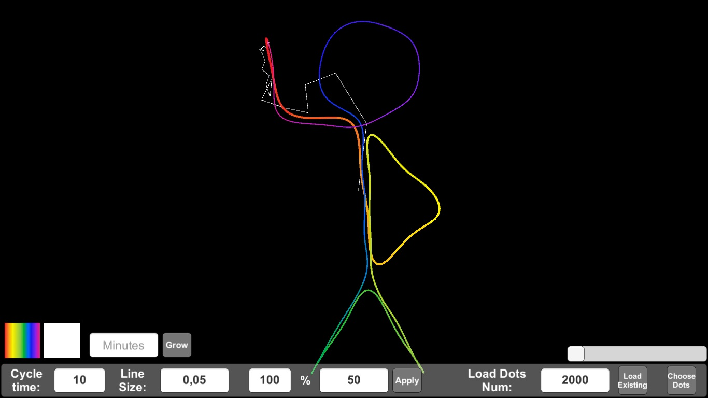

# Simple-Fourier-Drawer
This is an application in which you can easily create any figure using the Fourier transform. 

## How it works
[3Blue1Brown video](https://www.youtube.com/watch?v=r6sGWTCMz2k&list=LL&index=21&ab_channel=3Blue1Brown)

## How to use it
Download the archive. Go to Executable/, run FourierDrawer.exe (this is for Windows, if you have a different system, you can build the project yourself for your system)

First of all, you need to create an approximate trajectory along which the figure should be created. Transfer the image with the name "image" to the Executable folder. 
Then, go to the "Choose dots" section in the application, load image and select a trajectory by points (you can add (click), delete (double click), move points). 
 
After all, click "Export data".

### Drawing 

To start drawing, on the main screen, click "load existing data", select the desired number of drawing lines (in the middle), and click "Apply".
The rest of the parameters are additional, you can play with them. 

## Warnings!!!
* If you have more than 2000 points in the trajectory, you will have to change the corresponding parameter to a larger number ("Load Dots Num"). 
* If you have a jump between the first and last point of the trajectory, try changing (probably reducing) "Load Dots Num" parameter.
